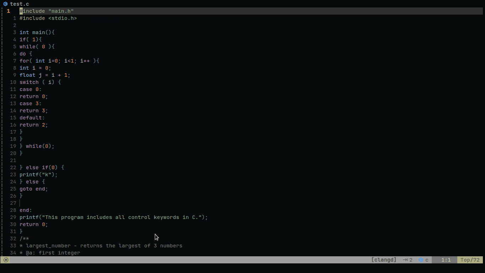

|	 PREVIEW  |  FEATURES |
| :--: | :--: |
|  | <ul style="padding: 30px;height: 100%;font-size: 18px;position: relative; display: flex; flex-direction: column;  justify-content: space-evenly; align-items: flex-start;list-style-type: none; text-transform: capitalize;"><li>indentation</li> <li>proper function and control keywords formatting</li> <li>auto-wrap of if-else statements</li> <li>documentation of undocumented functions</li> <li>wrapping return statements</li> </ul> |
### INSTALLATION
		- clone the repo
		- run the install.sh file as superuser:
####
		git clone https://github.com/HazelDaniel/betty-comply
		cd betty-comply
		sudo ./install.sh
###
		- all set!

### UPDATE
		- cd into the betty-comply directory
		- pull from the repo
		- run the update.sh file as superuser:
####
		git pull origin master
		sudo ./update.sh
### REMOVAL
		- cd into the betty-comply directory
		- run the flush.sh file as superuser:
####
		sudo ./flush.sh
### NAME
       _bettyComply - adjust a file to betty's standards
### SYNOPSIS
       _bettyComply [OPTION]... [FILE]...

### DESCRIPTION
				format a file to comply to betty ( the alx's C code parser that checks for errors in syntactic structure ) 's standards
       -,
           
       -, 
       -, 

### AUTHOR
       HAZEL DANIEL.
       
       Report bugs at https://github.com/HazelDaniel/betty-comply/issues.
       For contributions : https://github.com/HazelDaniel/betty-comply

A restricted C file formatter.
Copyright (C) 2023 Hazel Daniel. 
This program is free software; you can redistribute it and/or
modify it under the terms of the GNU General Public License
as published by the Free Software Foundation; either version 2
of the License, or (at your option) any later version.

This program is distributed in the hope that it will be useful,
but WITHOUT ANY WARRANTY; without even the implied warranty of
MERCHANTABILITY or FITNESS FOR A PARTICULAR PURPOSE.  See the
GNU General Public License for more details.

You should have received a copy of the GNU General Public License
along with this program; if not, write to the Free Software
Foundation, Inc., 51 Franklin Street, Fifth Floor, Boston, MA  02110-1301, USA.

